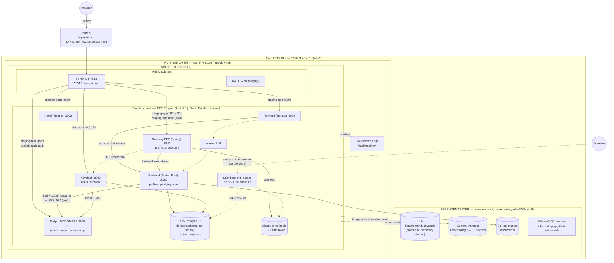
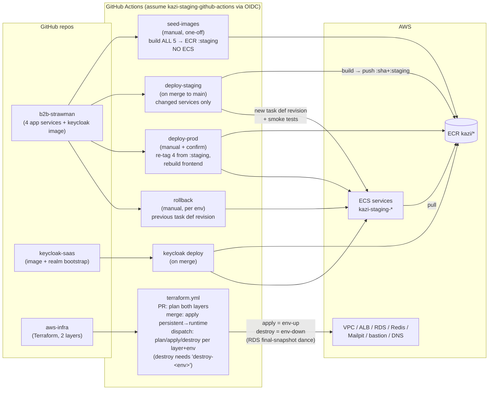
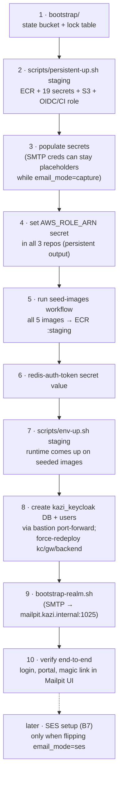

# Kazi AWS Architecture & CI/CD

Diagrams reflect the state after the persistent/runtime split (A11) with staging
values; production differs only in tfvars (2 NAT, no Spot, `email_mode=ses`, no
Mailpit/bastion by default).

## Infrastructure (staging)

Notes:
- The runtime layer references the persistent layer only via **naming convention
  + data sources** (`kazi/staging/<secret>`, `kazi/<svc>` ECR, `kazi-staging`
  bucket) — no remote-state coupling.
- `env-down.sh` destroys everything in the runtime box; RDS writes the final
  snapshot `kazi-staging-postgres-final`, which `env-up.sh` restores from
  (tenant schemas + Keycloak realm + users survive). Redis sessions and the
  Mailpit inbox do not.
- Switching `email_mode` capture↔ses = `terraform apply` (backend SMTP env) +
  re-running the Keycloak realm SMTP bootstrap step.

## CI/CD

## First-provisioning order (Part B runbook)

